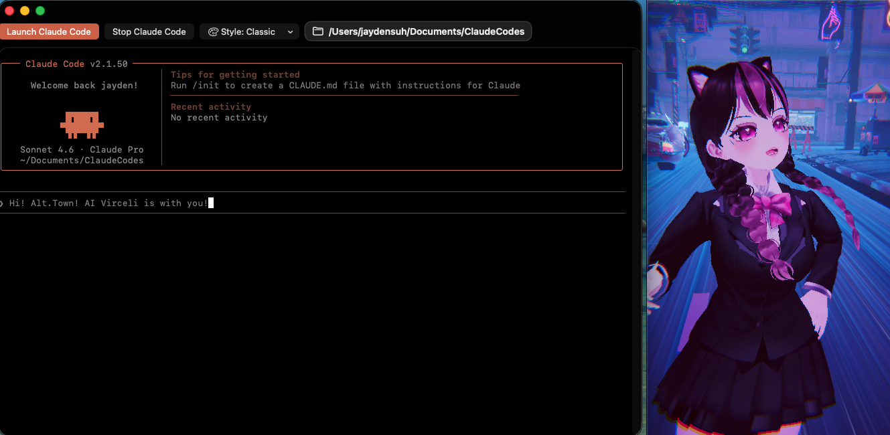

# Virceli (macOS)



Virceli is a macOS app that makes Claude Code more convenient and fun to use, with a desktop-style TUI workflow plus a live Unity avatar companion.

## Platform
- macOS only
- Developed and tested on macOS Tahoe 26.2
- Other macOS versions are not fully verified yet

## Features
### Claude Code convenience
- Save and reuse Claude Code workspace folder
- Save/manage resume sessions (`claude --resume ...`) with labels
- Launch Claude Code quickly from the app
- Lightweight TUI overlay styling
- Always-on-top and click-through controls (TUI window)

### AI Virceli companion
- Bundled Unity avatar runtime (`Resources/UnityPlayer/AvatarUnity.app`)
- Attach Unity window to left or right side of Virceli
- Reset avatar camera from app menu

## Requirements
- macOS (Tahoe 26.2 recommended based on current testing)
- Claude Code CLI installed (`claude` command available)
- Claude Code login completed in advance is recommended
- Accessibility permission is required for Unity panel attach/follow behavior

## Quick Start (Run From Source)
1. Open `Virceli.xcodeproj` in Xcode.
2. Select the `Virceli` scheme.
3. Press Run (`Cmd + R`).
4. In the app, choose your workspace folder and launch Claude Code.

## Install Prebuilt App (DMG)
1. Download the latest `.dmg` from [GitHub Releases](https://github.com/bitBLUE-Developer/AI-Virceli-Companion/releases).
2. Open the DMG and drag `Virceli.app` to `Applications`.
3. Launch `Virceli.app` once. You may see a block dialog with options like `Move to Trash` and `Done`.
4. Open `System Settings > Privacy & Security`.
5. In the Security section, find the message that macOS blocked Virceli and click `Open Anyway`.
6. Launch `Virceli.app` again. In the next dialog, click `Open Anyway` to allow execution.

## Accessibility Permission (Required)
Virceli needs Accessibility permission to control Unity panel position/attach behavior.

1. Open `System Settings > Privacy & Security > Accessibility`.
2. Add/enable `Virceli`.
3. Relaunch the app if needed.

## Included Runtime Resources
Primary embedded runtime:
- `Resources/UnityPlayer/AvatarUnity.app`

## Troubleshooting
### `claude` command not found
- Check CLI path:
```bash
command -v claude
```
- Check auth status:
```bash
claude auth status
```

### Unity attach does not work
- Verify Accessibility permission is enabled for Virceli.
- Relaunch Virceli after granting permission.
- In app menu, toggle attach again and reselect dock side (left/right).

### Claude session does not start
- Verify selected workspace path is valid.
- Verify Claude Code CLI is installed and logged in.

## Privacy / Local Data
Virceli stores local preferences only (e.g. workspace path, resume IDs/labels, UI settings) via macOS local app storage.
No dedicated cloud sync service is built into this repository.

## Contributing
See `CONTRIBUTING.md`.

## License
- App source code: MIT (`LICENSE`)
- Asset and third-party notices: `ASSETS_AND_ATTRIBUTION.md`
